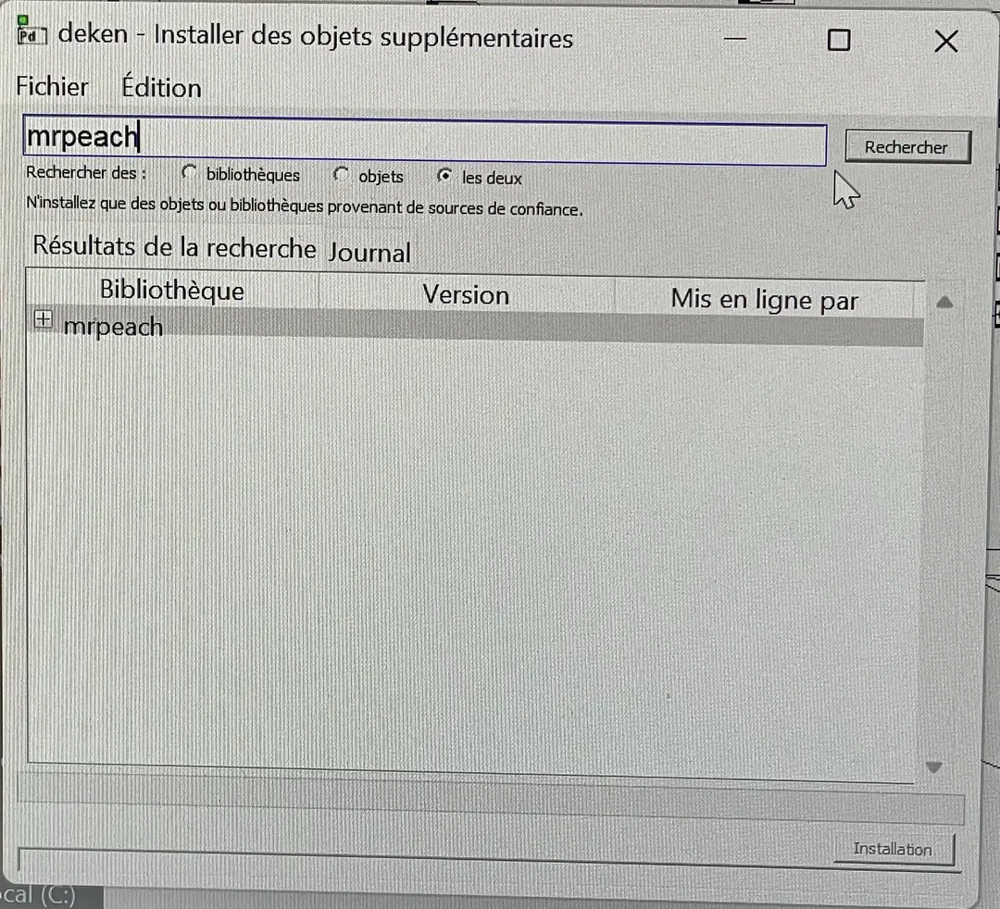
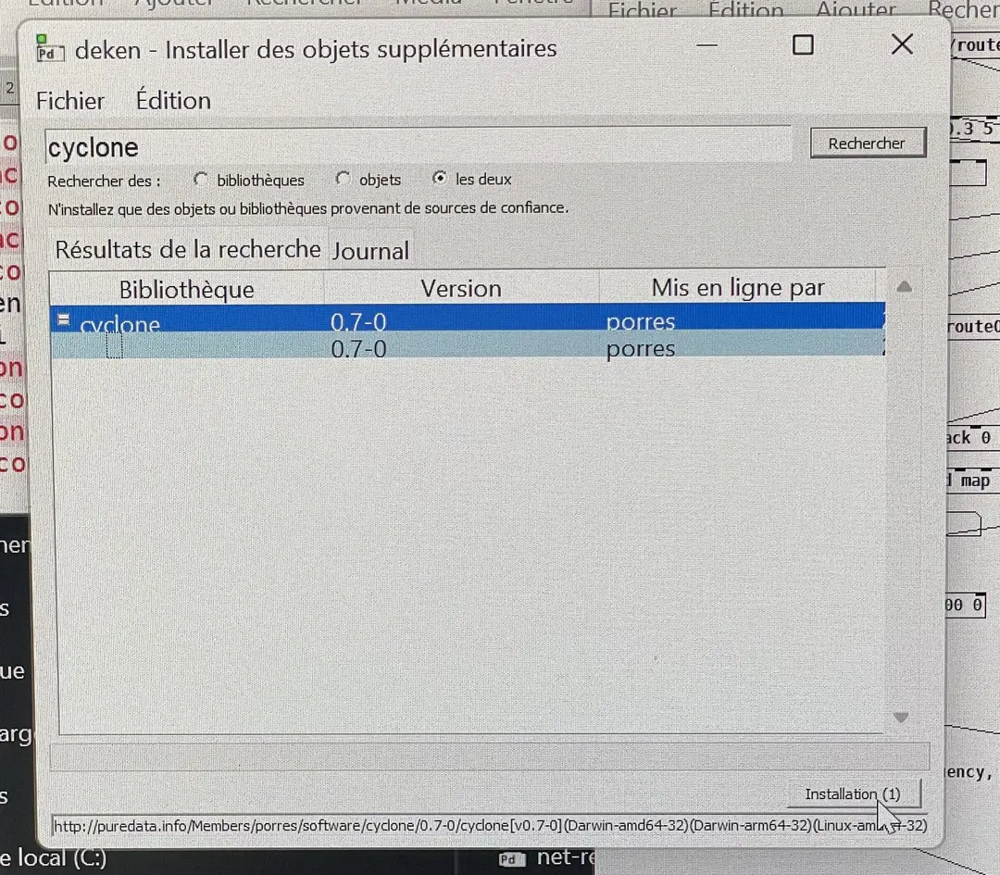

## Connection
* Connect iPad to network
* Open TouchOSC, open first tab connection, take note of Local IP Address
* Change `oscRemoteAddress` to this Local IP Address from iPad
* Type `ipconfig` in windows command line and add it under Host on the TouchOSC app

## Installation
### Pure Data
Install [Pure Data](https://puredata.info/downloads/pure-data) from here.

### Install Pure Data plugins
```
cyclone
mrpeach
```




### Processing
Install [Processing 4.2](https://processing.org/download)

### Processing plugins
```
spout
ani
oscP5
controlP5
```

